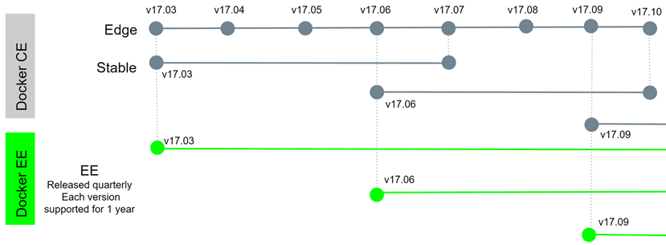

# 1 认识docker

介绍docker的前世今生，了解docker的实现原理，以Django项目为例，带大家如何编写最佳的Dockerfile构建镜像。通过本章的学习，大家会知道docker的概念及基本操作，并学会构建自己的业务镜像，并通过抓包的方式掌握Docker最常用的bridge网络模式的通信。

#### [认识docker](http://49.7.203.222:3000/#/docker/introduction?id=认识docker)

- why
- what
- how

###### [为什么出现docker](http://49.7.203.222:3000/#/docker/introduction?id=为什么出现docker)

需要一种轻量、高效的虚拟化能力

Docker 公司位于旧金山,原名dotCloud，底层利用了Linux容器技术（LXC）（在操作系统中实现资源隔离与限制）。为了方便创建和管理这些容器，dotCloud 开发了一套内部工具，之后被命名为“Docker”。Docker就是这样诞生的。

Hypervisor： 一种运行在基础物理服务器和操作系统之间的中间软件层，可允许多个操作系统和应用共享硬件 。常见的VMware的 Workstation 、ESXi、微软的Hyper-V或者思杰的XenServer。

Container Runtime：通过Linux内核虚拟化能力管理多个容器，多个容器共享一套操作系统内核。因此摘掉了内核占用的空间及运行所需要的耗时，使得容器极其轻量与快速。

###### [什么是docker](http://49.7.203.222:3000/#/docker/introduction?id=什么是docker)

基于操作系统内核，提供轻量级虚拟化功能的CS架构的软件产品。

基于轻量的特性，解决软件交付过程中的环境依赖

###### [docker能做什么](http://49.7.203.222:3000/#/docker/introduction?id=docker能做什么)

- 可以把应用程序代码及运行依赖环境打包成镜像，作为交付介质，在各环境部署
- 可以将镜像（image）启动成为容器(container)，并且提供多容器的生命周期进行管理（启、停、删）
- container容器之间相互隔离，且每个容器可以设置资源限额
- 提供轻量级虚拟化功能，容器就是在宿主机中的一个个的虚拟的空间，彼此相互隔离，完全独立

###### [版本管理](http://49.7.203.222:3000/#/docker/introduction?id=版本管理)

- Docker 引擎主要有两个版本：企业版（EE）和社区版（CE）
- 每个季度(1-3,4-6,7-9,10-12)，企业版和社区版都会发布一个稳定版本(Stable)。社区版本会提供 4 个月的支持，而企业版本会提供 12 个月的支持
- 每个月社区版还会通过 Edge 方式发布月度版
- 从 2017 年第一季度开始，Docker 版本号遵循 YY.MM-xx 格式，类似于 Ubuntu 等项目。例如，2018 年 6 月第一次发布的社区版本为 18.06.0-ce

###### [发展史](http://49.7.203.222:3000/#/docker/introduction?id=发展史)

13年成立，15年开始，迎来了飞速发展。

Docker 1.8之前，使用[LXC](https://linuxcontainers.org/lxc/introduction/)，Docker在上层做了封装， 把LXC复杂的容器创建与使用方式简化为自己的一套命令体系。

之后，为了实现跨平台等复杂的场景，Docker抽出了libcontainer项目，把对namespace、cgroup的操作封装在libcontainer项目里，支持不同的平台类型。

2015年6月，Docker牵头成立了 OCI（Open Container Initiative开放容器计划）组织，这个组织的目的是建立起一个围绕容器的通用标准 。 容器格式标准是一种不受上层结构绑定的协议，即不限于某种特定操作系统、硬件、CPU架构、公有云等 ， 允许任何人在遵循该标准的情况下开发应用容器技术，这使得容器技术有了一个更广阔的发展空间。

OCI成立后，libcontainer 交给OCI组织来维护，但是libcontainer中只包含了与kernel交互的库，因此基于libcontainer项目，后面又加入了一个CLI工具，并且项目改名为runC (https://github.com/opencontainers/runc )， 目前runC已经成为一个功能强大的runtime工具。

Docker也做了架构调整。将容器运行时相关的程序从docker daemon剥离出来，形成了**containerd**。containerd向上为Docker Daemon提供了`gRPC接口`，使得Docker Daemon屏蔽下面的结构变化，确保原有接口向下兼容。向下通过`containerd-shim`结合`runC`，使得引擎可以独立升级，避免之前Docker Daemon升级会导致所有容器不可用的问题。

也就是说

- runC（libcontainer）是符合OCI标准的一个实现，与底层系统交互
- containerd是实现了OCI之上的容器的高级功能，比如镜像管理、容器执行的调用等
- Dockerd目前是最上层与CLI交互的进程，接收cli的请求并与containerd协作

###### [小结](http://49.7.203.222:3000/#/docker/introduction?id=小结)

1. 为了提供一种更加轻量的虚拟化技术，docker出现了
2. 借助于docker容器的轻、快等特性，解决了软件交付过程中的环境依赖问题，使得docker得以快速发展
3. Docker是一种CS架构的软件产品，可以把代码及依赖打包成镜像，作为交付介质，并且把镜像启动成为容器，提供容器生命周期的管理
4. docker-ce，每季度发布stable版本。18.06，18.09，19.03
5. 发展至今，docker已经通过制定OCI标准对最初的项目做了拆分，其中runC和containerd是docker的核心项目，理解docker整个请求的流程，对我们深入理解docker有很大的帮助